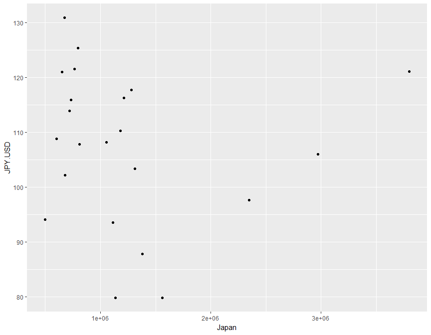
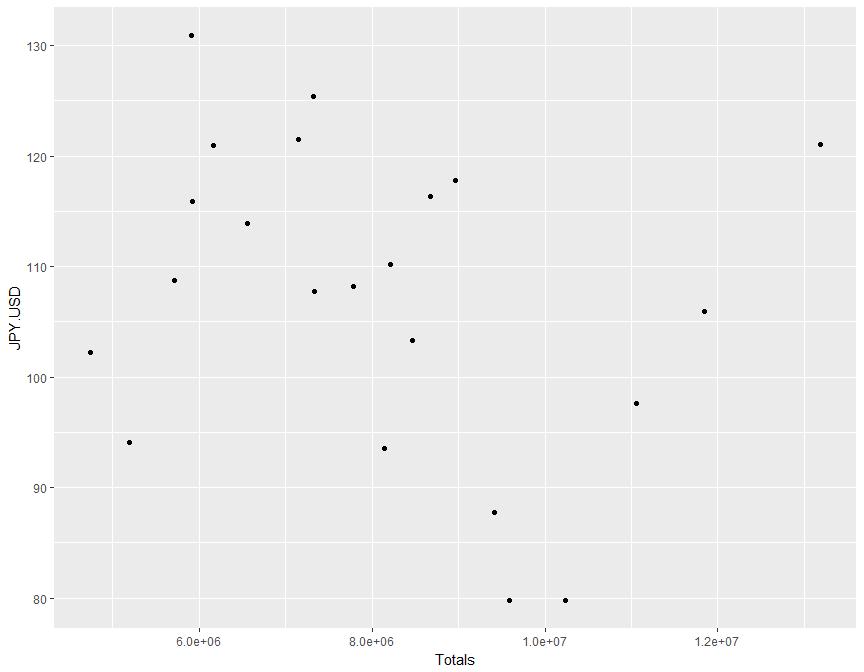
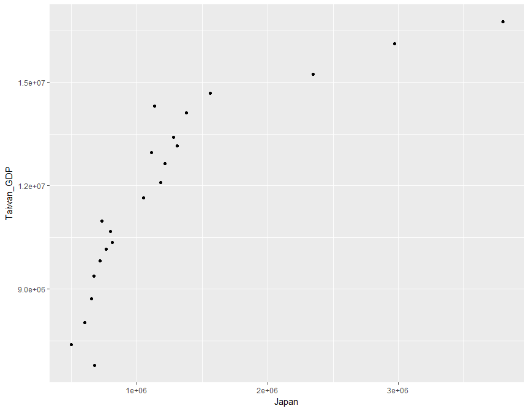
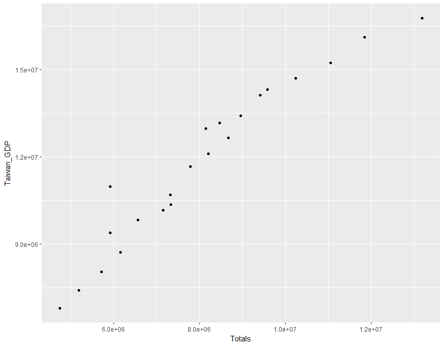
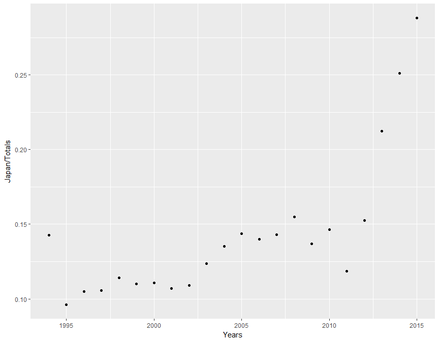

# Analysis of outbound tourism statistics
Group 13  
2016年12月11日  


# Final Project

內文.....略


```r
tbl_df(Team13)
```

```
## # A tibble: 22 × 5
##    Years  Japan  Totals  JPY.USD Taiwan_GDP
##    <dbl>  <dbl>   <dbl>    <dbl>      <int>
## 1   1994 676944 4744434 102.2083    6784442
## 2   1995 498565 5188658  94.0600    7396650
## 3   1996 600146 5713535 108.7800    8036590
## 4   1997 651597 6161932 120.9908    8717241
## 5   1998 674089 5912383 130.9042    9381141
## 6   1999 720903 6558663 113.9075    9815595
## 7   2000 811388 7328784 107.7658   10351260
## 8   2001 765247 7152877 121.5300   10158209
## 9   2002 797460 7319466 125.3883   10680883
## 10  2003 731330 5923072 115.9333   10965866
## # ... with 12 more rows
```

#分布關係


```r
#日本出國旅遊人數跟日圓匯率分布關係
ggplot(Team13,aes(x = Japan,y= JPY.USD)) + geom_point(stat = "identity")
```

<!-- -->

```r
#總出國旅遊人數跟日圓匯率分布關係
ggplot(Team13,aes(x = Totals,y= JPY.USD)) + geom_point(stat = "identity")
```

<!-- -->

```r
#日本出國旅遊人數跟台灣GDP分布關係
ggplot(Team13,aes(x = Japan,y= Taiwan_GDP)) + geom_point(stat = "identity")
```

<!-- -->

```r
#總出國旅遊人數跟台灣GDP分布關係
ggplot(Team13,aes(x = Totals,y= Taiwan_GDP)) + geom_point(stat = "identity")
```

<!-- -->

```r
#年份-(日本/總出國人數)
ggplot(Team13,aes(x = Years,y = Japan/Totals)) + geom_point(stat = "identity")
```

<!-- -->

#假設


```r
#從2011年開始去日本比率高升
#假設一：2011年開始出現多往日本的廉航班機
#假設二：日本開始發展觀光產業
```
